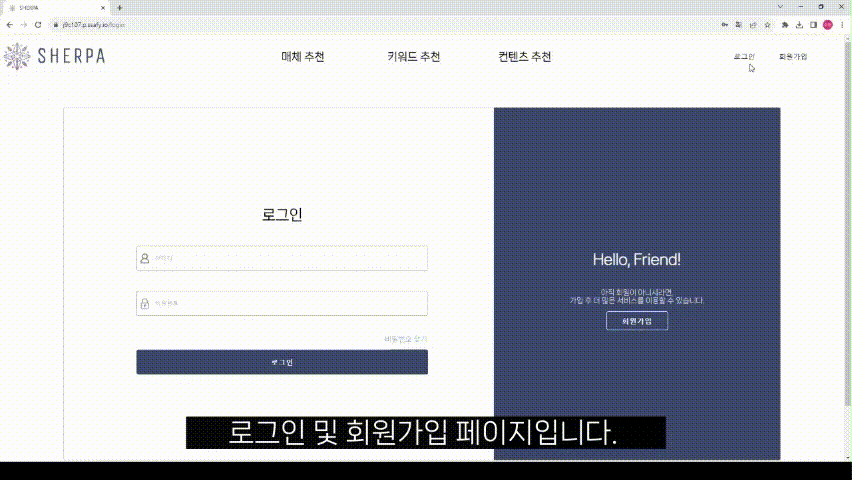
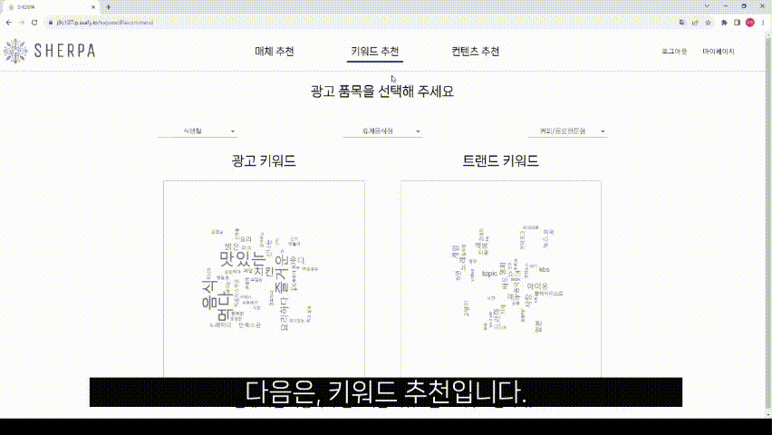
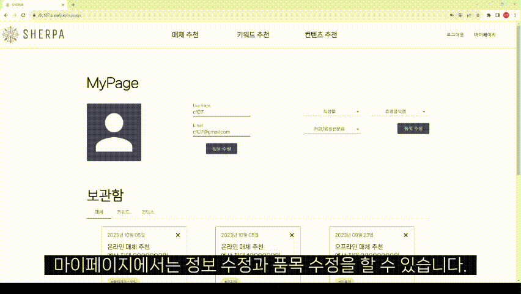
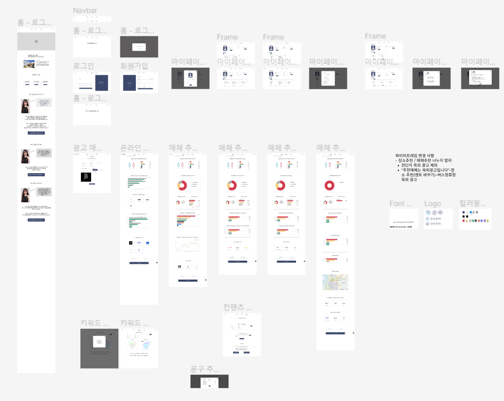
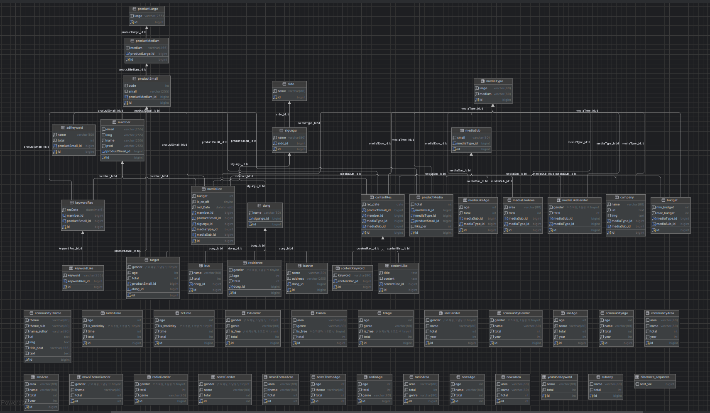

# 빅데이터를 기반으로 하는 고객 맞춤형 광고 매체 유형 및 키워드, 컨텐츠 추천 서비스

### 배포 주소

> 📌 https://j9c107.p.ssafy.io

### 시연 영상

> 📌 https://youtu.be/UOcts68R_CU

# 📌기술 스택

### Back-End

<div>
  
  
  
  
  
  
</div>

### Front-End

<div>
  
  
  
  
</div>

### DataBase

<div>
  
  
</div>

### VCS

<div>
  
  
</div>

### IDE

<div>
  
  
  
</div>

### CI/CD

<div>
  
  
  
  
</div>

### Environment

<div>
  
  
  
  
  
  
  
</div>

# 📌서비스 소개

## 서비스 설명

### 개요

- 서비스 명 : SHERPA
  - 히말라야 산맥에서 등반을 할 때 등산객을 안내하고 보호하는 역할을 하는 사람을 "셰르파"라고 부른다. 셰르파들은 히말라야 지역에서 주로 활동하며 고산 지대에서의 경험과 지식을 가지고 있어 등반을 안전하게 이끌어주는 중요한 역할을 한다. 히말라야 등반은 고도와 악천후와 같은 위험 요소가 존재하기 때문에 셰르파들의 전문적인 도움이 필요하다.
  - 우리가 빅데이터를 활용해 기업 홍보, 제품 광고의 목표를 이끌어주는 역할을 하겠다.
    우리의 전문적인 도움을 주겠다는 뜻
  - 나침반 + 눈꽃송이(셰르파)
- 프로젝트 명 : "맞춤형 광고 전략 추천" 서비스

# 📌기획 배경

- 같은 SNS 채널의 가게들과 차별성이 없는 광고로 홍보 효과 없음
    <aside>
    💡 사용자 맟춤형으로 광고 전략을 분석하고 내용을 구성하여 제작사와 매칭해주는 서비스 필요
    
    </aside>

- 광고 진행 상황과 단가 내역을 파악하기 어려움
    <aside>
    💡 광고 타겟층, 지역, 매체, 컨텐츠, 가격대를 직접 확인할 수 있는 서비스 필요
    
    </aside>


# 📌 데모

### 필수 사항

```bash
Node.js 18.16.1
SpringBoot 2.7.15
```

### 권고 사항

- Chorme Browser

### 설치

```bash
# git clone
git clone https://lab.ssafy.com/s09-bigdata-recom-sub2/S09P22C107.git
```

### Back-End

```bash
# backend 폴더로 이동
cd backend
./gradlew build
cd build/libs
ls -arlth
java -jar adrec-0.0.1-SNAPSHOT.jar
```

### Front-End

```bash
# frontend 폴더로 이동
cd frontend
npm i
npm start
```

# 📌기능 소개

## 주요 기능

⭐ 협업 필터링 알고리즘을 이용한 오프라인 매체 추천 기능

⭐ 협업 필터링 알고리즘을 이용한 맞춤형 키워드 추천 기능

⭐ Word2Vec을 이용한 커뮤니티 세부 주제별 추천

⭐ 회원 관리 (회원 정보 관리, 품목 정보 관리, 추천 결과 보관함 관리)

⭐ chat gpt - 키워드 추천, 시나리오 추천

⭐ kakao map - 현수막 게시장소 추천

⭐ react-chartjs-2 - 차트 UX/UI

## 세부 기능

1. 추천 기능
   - 품목별 자주 사용된 광고 매체 추천
   - 커뮤니티 세부 주제별 추천
   - TV/라디오/신문에서 자주 이용하는 채널이나 신문사 분야를 추천
   - AI를 활용한 광고 컨텐츠 생성
2. 분석 기능
   - 품목 선택을 통한 타겟팅 광고의 성별/연령대 분석
   - 성별 / 연령대가 많이 모여있는 장소를 분석
   - 워드 클라우드 형식으로 광고 키워드 시각화
3. 회원 관리
   - 추천 받은 데이터 관리
   - 고객 정보 관리
4. 부가 기능
   - 광고 매체에 따른 제작사 매칭
   - 좋아요한 키워드와 컨텐츠를 보관


# 📌시연 시나리오 & 영상

## 메인 페이지

- 셰르파의 기획의도, 이용 안내 페이지 입니다.


## 회원가입, 로그인

- 아이디를 입력하고 중복 확인을 합니다. 중복되지 않은 아이디면 사용 가능한 아이디입니다 라는 메시지가 뜹니다.
- 비밀번호 확인을 위해 입력한 비밀번호를 똑같이 작성합니다.
- 이메일을 입력하고 중복 확인을 합니다. 중복되지 않은 이메일이면 사용 가능한 아이디입니다 라는 메시지가 뜹니다.
- 모든 정보를 작성한 후 회원가입 버튼을 클릭하면 회원가입이 성공하였다는 알림창이 뜨고 로그인 창으로 넘어갑니다.
- 회원가입한 아이디와 비밀번호를 맞게 입력하고 로그인 버튼을 클릭하면 로그인 성공과 함께 메인 페이지로 이동합니다.
- 로그인 실패 시, 이메일 또는 비밀번호가 틀렸을 경우 로그인이 실패하였다는 알림창이 뜹니다.



## 매체 추천

- 광고할 물품이나 서비스, 광고 예산, 거주 지역, 온라인/오프라인 광고를 입력합니다.
- 광고 타겟을 추천 받습니다.
- 추천 받은 타겟이 자주 이용하는 광고 매체를 광고 예산, 거주 지역을 감안하여 추천합니다.
- 추천에 걸맞은 제작사를 매칭해줍니다.
- 원하는 결과를 보관함에 저장할 수 있습니다.


## 키워드 추천

- 광고할 품목을 입력받아 광고 키워드, 트렌드 키워드를 워드 클라우드 형태로 추천받습니다.
- 다른 사용자가 좋아요한 키워드를 추천받습니다.
- 원하는 키워드를 보관함에 저장할 수 있습니다.



## 컨텐츠 추천

- 광고 매체와 광고 품목, 키워드를 입력 받습니다..
- TV, 라디오의 경우 시나리오를, 그 외의 매체는 광고를 추천받습니다.
- 원하는 컨텐츠를 보관함에 저장할 수 있습니다.


## 마이페이지

- 본인의 이메일과 닉네임을 확인할 수 있습니다.
- 회원 정보 수정 버튼을 클릭하면 정보를 수정할 수 있는 모달창이 뜹니다.
- 이메일과 비밀번호를 변경하고 싶은 경우 수정할 수 있습니다.
- 본인이 선택한 품목을 확인하고 수정할 수 있습니다.
- 매체 추천 시, 보관함에 저장한 결과를 확인할 수 있습니다.
- 키워드 추천 시, 보관함에 저장한 결과를 확인할 수 있습니다.
- 보관함 추천 시, 보관함에 저장한 결과를 확인할 수 있습니다.
- 보관함에 저장한 결과는 삭제가 가능합니다.



# 📌프로젝트 진행 및 산출물

### 프로젝트 개발 기간

```2023.08.21.``` ~ ```2023.10.06.``` (7주)

### 프로젝트 산출물

### 1. Figma



### 2. ERD



### 3. API 설계서


### 4. 요구사항 정의서


### 5. 시스템 아키텍처


### 6. User Flow


### 7. Git Flow 브랜치 전략


- Git branch 컨벤션
  - `[BE/FE/AL]_[feature/release/hotfix]/기능명`
  - `BE_feature/기능명`, `FE_release/기능명`, `FE_hotfix/기능명`
  - `DATA_feature/기능명`, `DATA_release/기능명`, `DATA_hotfix/기능명`
  - feature, release, hotfix 를 쓰기
  - AL은 빅데이터 관련
  - 소문자, 하이픈(-), 밑줄(_) 만 사용, 대문자 사용 X

- Git commit 메시지 컨벤션
  - <타입> 리스트
    - 💡  **Feat: 새로운 기능 추가**
    - 🐛 **Fix: 오류에 대한 문제 해결**
    - ⚡ **Patch: 기능 개선**
    - 📝 **Docs: 문서 작업**
    - 🎨 **Design: CSS 등 사용자 UI 디자인 변경**
    - ✏️ **Style: 간단한 코드 작업 (코드 형식, 세미콜론 추가: 비즈니스 로직 변경 없음)**
    - 🔍 **Merge**: **develop 머지 충돌시 수정후 커밋**
    - 🏷️ **Rename**: **파일 혹은 폴더명을 수정하거나 옮기는 작업만 한 경우**
    - 🔥 **Remove**: **파일을 삭제하는 작업만 수행한 경우**
  - git commit -m “Feat: 최대한 간단한 설명”
    - ex) `💡 Feat: 로그인 추가`
  - 제목 첫 글자를 대문자
  - 제목은 명령문

### 7. Jira


- 목적: 협업, 일정, 업무 관리
- 방법
  1. 월요일 오전에 주 단위 계획
  2. 백로그 생성
  3. 스프린트 시작
- 스프린트: 일주일 단위

**에픽**

- 에픽은 반드시 생성하고 작업을 연동시킨다
- 기능의 에픽 이름은 `기능 명세서의 주 기능`으로 한다
- 컴포넌트가 통합이 에픽들은 해당하는 개발 단계에 맞춰서 작성한다

**작업**

- 작업 생성 시 기능에 따라 컴포넌트를 연동시킨다
  - 스토리 포인트는 최대 4시간으로 제한한다
    - 스토리 포인트는 중요도 순서로 할당 (4 → 3 → 2 → 1 **시간**)
- 작업을 완료할 때 쯤 작업 설명에 자신이 한 작업에 대해 자세히 작성해둔다

**컴포넌트**

- 작업의 유형에 따라 `FE` / `BE` / `통합` 컴포넌트를 넣어준다
- `FE` : 프론트엔드
- `BE` : 백엔드 - spring, fastapi 폴더
- `DATA` : 빅데이터 데이터 전처리 - bigdata 폴더
- `통합` : 기획, 설계, 최종, 발표 준비 등등

### 8. 프로젝트 구조

**Front-End (React)**

```
📁frontend
├── 📁public
└── 📁src
    ├── 📁assets
    │   ├── 📁fonts
    │   └── 📁img
    ├── 📁components
    │   ├── 📁atoms
    │   ├── 📁organisms
    │   └── 📁pages
    │       ├── 📁Auth
    │       ├── 📁ContentRecommendPage
    │       ├── 📁KeywordRecommendPage
    │       ├── 📁MainPage
    │       ├── 📁MediaRecommendPage
    │       ├── 📁MyPage
    │       ├── 📁NewspaperRecommendation
    │       ├── 📁OnlineRecommendation
    │       ├── 📁OutdoorRecommendation
    │       ├── 📁RadioRecommendation
    │       └── 📁TvRecommendation
    ├── 📁routes
    ├── 📁slices
    └── 📁store
```

**Back-End (Spring Boot, FastAPI)**

```
📁spring
├── 📁gradle
│   └── 📁wrapper
└── 📁src
    └── 📁main
        ├── 📁java
        │   └── 📁com
        │       └── 📁ssafy
        │           └── 📁adrec
        │               ├── 📁jwt
        │               │   └── 📁service
        │               ├── 📁area
        │               │   ├── 📁controller
        │               │   ├── 📁repository
        │               │   ├── 📁response
        │               │   └── 📁service
        │               ├── 📁content
        │               │   ├── 📁controller
        │               │   ├── 📁repository
        │               │   ├── 📁request
        │               │   ├── 📁response
        │               │   └── 📁service
        │               ├── 📁keyword
        │               │   ├── 📁controller
        │               │   ├── 📁repository
        │               │   ├── 📁request
        │               │   ├── 📁response
        │               │   └── 📁service
        │               ├── 📁media
        │               │   ├── 📁controller
        │               │   ├── 📁repository
        │               │   ├── 📁response
        │               │   └── 📁service
        │               ├── 📁member
        │               │   ├── 📁controller
        │               │   ├── 📁repository
        │               │   ├── 📁request
        │               │   └── 📁service
        │               ├── 📁myPage
        │               │   ├── 📁controller
        │               │   ├── 📁repository
        │               │   ├── 📁request
        │               │   ├── 📁response
        │               │   └── 📁service
        │               ├── 📁product
        │               │   ├── 📁controller
        │               │   ├── 📁repository
        │               │   ├── 📁response
        │               │   └── 📁service
        │               ├── 📁targetAnalyze
        │               │   ├── 📁controller
        │               │   ├── 📁repository
        │               │   ├── 📁request
        │               │   ├── 📁response
        │               │   └── 📁service
        │               └── 📁offline
        │                   ├── 📁controller
        │                   └── 📁outdoor
        │                       ├── 📁repository
        │                       ├── 📁request
        │                       ├── 📁response
        │                       └── 📁service
        └── 📁resources
```

```
📁fastapi
└── 📁app
    ├── 📁algorithm
    └── 📁routers

```

# 📌개발 멤버

## 개발팀 소개

| 연주원                               | 손효민                                | 최다해                     | 이민규                          | 이정찬                         | 양수완                      |
| ------------------------------------ | ------------------------------------- | -------------------------- | ------------------------------- | ------------------------------ | --------------------------- |
| https://github.com/joo1yeon          | https://github.com/SonHyoMin00        | https://github.com/dahae8  | https://github.com/lmg386411    | https://github.com/jeongchanim | https://github.com/kjjs2670 |
| 팀장, PM, Back-end, Infra, 기획 발표 | BE-Leader, Back-end, Data 분석 & 추천 | Back-end, Data 분석 & 추천 | FE-Leader, Front-end, 최종 발표 | Front-end, Data 분석           | Front-end, UCC 제작         |
